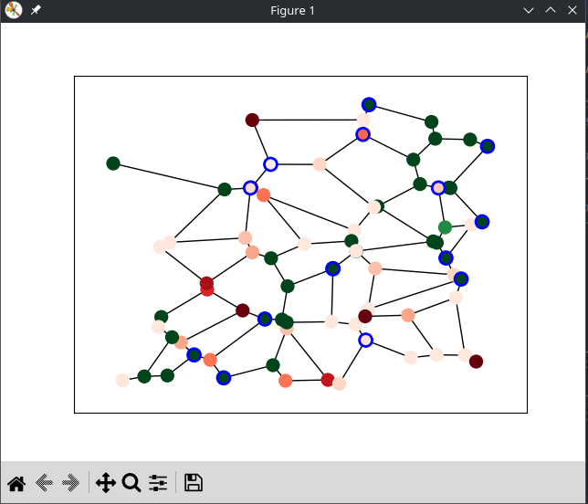
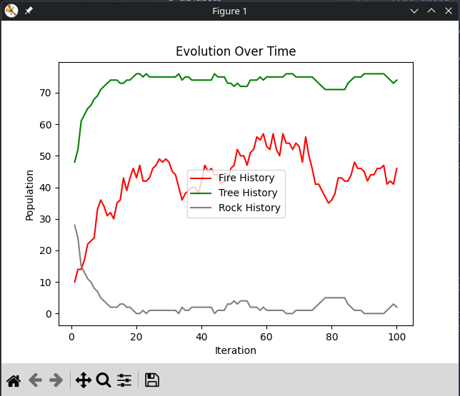
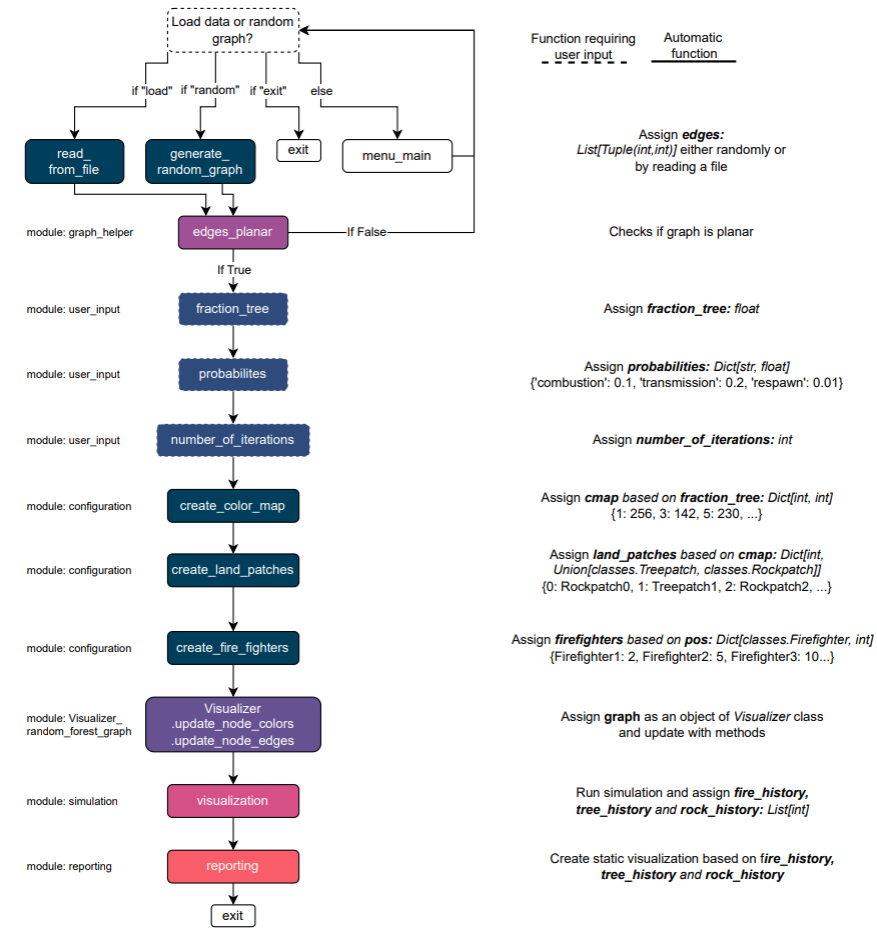

## Project Description
This project was created as part of the "Introduction to Programming" course (2023) at the University of Southern Denmark in the Computational Biomedicine program.
Please note that files `visualiser_random_forest_graph.py` and `graph_helper.py` were supplied by course responsible, Antonio Rago, Department of Mathematics and Computer Science, SDU.

This project simulates fire spread and suppression on a randomly generated or file-loaded graph landscape using agents (firefighters). It includes visual and static graphical output of the simulation.

Users may select a number of options:
```
1. Terrain data
  - Load from file
  - Use randomly generated data
2. Initial landscape
  - All trees
  - All rocks
  - A fixed ratio (tree/rock)
3. Probability of self combustion (tree patches randomly catching fire)
4. Probabiliy of fire transmission (tree patches catching fire from neighboring tree patch which is on fire)
5. Probability of rock to tree conversion (Rock patches becoming tree patches)
6. Number of iterations (simulation length)
7. Number of firefighters
8. Average firefighter skill level (higher levels put out fire faster)
```

After user selections, the simulation begins and is visualized as a graph network:


Green nodes: Tree patches
Red nodes: Tree patches on fire (hue of red denotes health)
Gray: Rock patches
Blue ring around nodes: Nodes with firefighters present

Firefighters travel toward neighboring patches that are on fire, or stay if current patch is on fire. Each firefighter heals according to his/her skill level.
Tree patches that are not on fire may spontaneously combust. Tree patches that are on fire lose health until they turn into a rock patch.
Rock patches may spontaneously turn into tree patches.

After the desired number of iterations, the dynamics of land patch conversion are visualized in a plot:


## Folder structure
```
├── classes.py                          #Document containing used classes
├── cnfg                                #Folder containing example files for landpatches to be loaded
│   ├── graph1.dat
│   ├── graph2.dat
│   ├── graph3.dat
│   ├── graph4.dat
│   ├── graph5.dat
│   └── graph6.dat
├── graph_forest.py                    #Main script
├── graph_helper.py                    #Creates network layout from loaded text file (Antonio Rago)
├── module_configuration.py            #Functions used to create landpatches based on user input
├── module_file_reader.py              #Function to load text files
├── module_reporting.py                #Function to create static graph after simulation
├── module_simulation.py               #Functions to update simulation each frame/iteration
├── module_user_input.py               #Functions related to accepting user input
├── README.md                          #This file
├── requirements.in                    #File to track used packages and their versions
├── requirements.txt                   #pip-tools created file w. packages(incl. dependencies + versions). Used by pip-sync
├── screenshots                        #Screenshots to display in this README file
│   ├── dynamics_graph.png
│   ├── program_structure.png
│   └── simulation.png
└── visualiser_random_forest_graph.py  #Creates graph network visualization (Antonio Rago)

```

The simulation structure is shown schematically below:


## Setup
Clone the repo
```bash
git clone https://github.com:s-jessen/simulation_python_firefighters.git
```

For full reproducibility, create a virtual environment. This setup uses venv and pip-tools:

```bash
#Create virtual environment
python -m venv .venv

#Activate virtual environment (Linux/MacOS)
source .venv/bin/activate

#Activate virtual environment (Windows)
#.venv\Scripts\activate.bat

#Install pip-tools (used to manage reproducible environments)
pip install pip-tools

#Install all repository packages and dependencies in correct versions
pip-sync
```
This project was developed using Python 3.11. Use a compatible version for best results.


